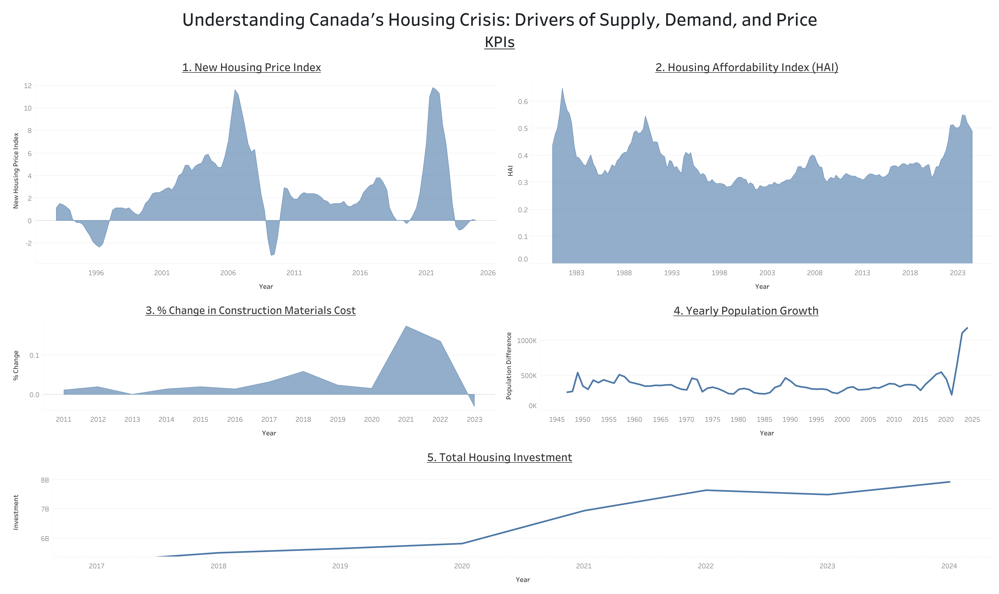
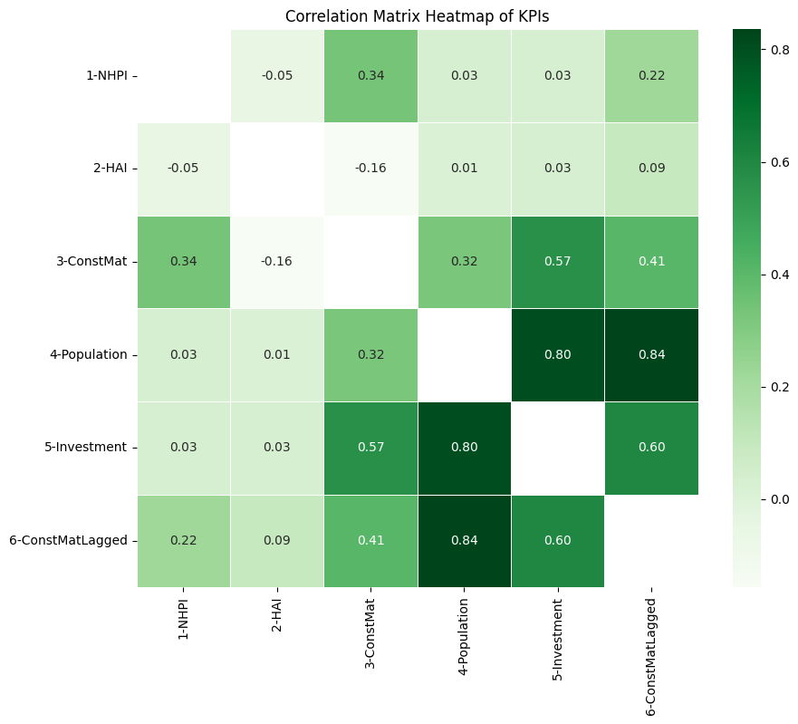
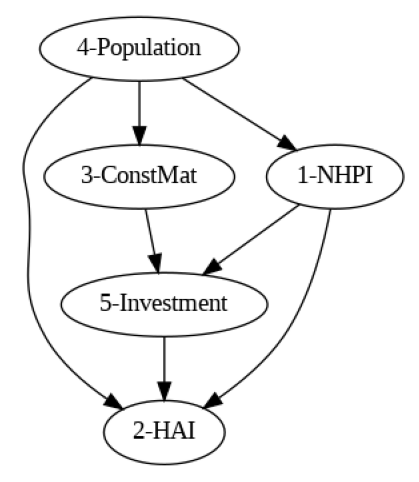
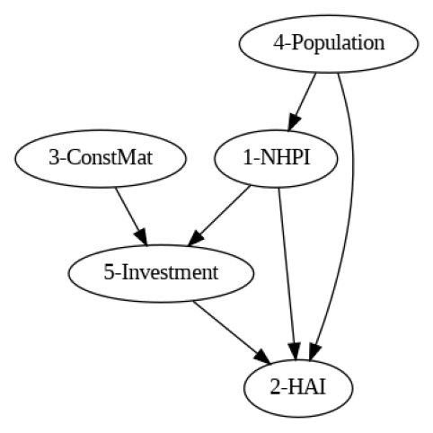
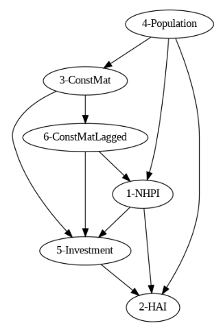

# Understanding Canada's Housing Crisis: Drivers of Supply, Demand, and Price

*A Decision Intelligence Analysis of SDG 11 - Sustainable Cities and Communities*

By: Logan Pugsley

## Executive Summary

This project examines Canada's housing crisis from the perspective of UN Sustainable Development Goal 11 (Sustainable Cities and Communities). Using open data that contains relevant data for various housing indicators and inputs, we aim to identify the key factors driving housing affordability, supply, and demand. Our analysis will use various data analytics, data visualization, and decision intelligence techniques to uncover insights about housing market trends, affordability gaps, and potential policy interventions.

## Table of Contents
1. Executive Summary

2. Background

2. Key Performance Indicators (KPIs)

3. Analysis of Key Performance Indicators (KPIs)

4. Statistical Learning

5. Conclusion

## Background
[Read detailed background information here](Background.md)

## Key Performance Indicators (KPIs)
1. New Housing Price Index (NHPI)
   - Value: The New Housing Price Index provides a clear measure of how much the contractors who build new residential homes are selling their buildings for. It helps to identify impacts from construction materials and the total costs to build a home.
   - Indicates contractors' selling prices of new residential homes
   - Monthly series that measures changes over time
   - Detailed specifications pertaining to each house remain the same between two consecutive periods of measurement
   - Technical Details
      - Frequency: Monthly
      - Range: January 1981 - Present

2. Housing Affordability Index (HAI)
   - Value: The Housing Affordability Index (HAI) provides a clear measure of how affordable housing is relative to income levels. It helps identify whether housing costs are sustainable for the average household.
   - Measures the share of disposable income that a median-income household puts toward housing-related expenses
   - Ratio of housing-related costs (mortgage payments and utility fees) to average household disposable income
   - The higher the ratio, the more difficult it is to afford a home
   - Technical Details
      - Frequency: Quarterly
      - Range: 1983 Q3 - Present

3. Percentage Change in Construction Materials Cost
   - Value: The percentage change for the cost of construction materials provides a measure to indicate if prices for raw materials used in housing construction are rising or falling. It helps to identify if construction costs are contributing to higher or lower housing prices.
   - Construction costs are a key determinant for the supply of housing
   - The higher the percentage change from year-to-year, the higher the price of construction materials in that year
   - Technical Details
      - Frequency: Annually
      - Range: 2011 - Present

4. Yearly Population Growth
   - Value: The yearly population growth measures how much Canada's population grows each year. It helps to identify if there are more or less people in the housing market in Canada.
   - Population growth is a key determinant for the demand of housing
   - The higher the population growth, the higher the anticipated demand for housing should be
   - Technical Details
      - Frequency: Annually
      - Range: 1945 - Present

5. Total Housing Investment
   - Value: The total housing investment measures how much capital is being allocated and spent to grow and update Canada's housing market. It can be a lagging indicator to measure how the supply for housing could increase in future periods.
   - Housing investment is another key determinant for the supply of housing
   - The higher the total housing investment, the more new housing and converted housing developments should be available on the market
   - Technical Details
      - Frequency: Annually
      - Range: 2017 - Present

## Analysis of Key Performance Indicators (KPIs)

1. New Housing Price Index (NHPI)

   The NHPI fluctuates over time with the economy and housing market, however significant spikes were observed in both 2006 and in 2021, indicating rapid price increases during those periods. In 2008, during the global financial crisis, a notable decrease was seen in the NHPI, indicating that prices decreased greatly in that period. There is a slight decrease in 2023/2024 coming out of the Covid-19 global pandemic, but not as drastic of a return as seen in 2008. Overall, this KPI indicates that external factors, like economic recessions and housing policy changes have influences on housing prices.

2. Housing Affordability Index (HAI)

   The HAI is another index that fluctuates over time, but indicates how much a median-income household spends toward housing-related costs compared to their overall income. Generally, financial planners suggest that households put approximately 30% of their disposable income towards housing, to be able to live financially stable. As indicated in the visualization, from 1995 to 2019, the HAI hovered around 30%, however, since 2020 there have been sharp increases, reaching as much as 55%. This indicates that households across Canada are being forced to pay more for their housing, leaving them less disposable income to pay for groceries, entertainment, and save for their long-term financial goals.

3. Percentage Change in Construction Materials Cost

   The visualization for the percentage change in construction materials cost shows rapid prices increases in 2020 and 2021 as the Covid-19 pandemic created a major supply chain disruption for raw materials. Interestingly, this increase correlates to the exact same time that both the the NHPI and the HAI saw tremendous increases, indicating that the price of construction materials is a key driver for both the supply of housing, and the price of that supply. These higher construction material costs have contributed to increased housing prices, making new construction and housing affordability key issues inside of Canada's housing crisis.

4. Yearly Population Growth

   For the 80 years shown on the yearly population growth visualization, Canada has seen relatively steady increases to its population, as it encourages immigration for people to move to the wonderful country. After decades of stability, there was a massive spike in Canada's population beginning in 2023, with over one million newcomers to Canada each year. This population growth was driven and encouraged by changes to the Government of Canada's immigration policies. Although population growth can be a good way to help grow economies, in terms of Canada's housing crisis, the rapid population increases seen since 2023 have dramatically increased housing demand, putting extreme pressure on an already weak supply of housing, thus increasing prices and affecting affordability.

5. Total Housing Investment

   The total housing investment indicator's visualization shows steady increases in investment over time in Canada's housing market, with a notable increase since 2020. This trend indicates that although there are affordability concerns for construction materials, money is still flowing into the housing market. This increased investment could indicate various efforts to address supply shortages for housing, but still may not be enough to meet increased demand and offset affordability challenges.

[For additional visualizations related to these KPIs, click here](Visualizations.md)

## Statistical Learning
Building on the preliminary analysis of Canada's housing crisis and visualization of key performance indicators (KPIs), advanced statistical techniques were used to better track relationships and interdependencies between KPIs. Specifically, a correlation and causal inference analysis was performed against six KPIs and their data to enable a statistical learning of Canada's housing crisis. To recap, these are the KPIs that were included as datapoints within the statistical analysis:
1. NHPI

   Average New Housing Price Index (NHPI), measured quarterly.

2. HAI

   Average Housing Affordability Index (HAI), measured quarterly.

3. ConstMat

   Average percentage change in construction materials cost, measured annually.

4. Population

   Difference in Canada's population from previous period, measured annually.

5. Investment

   Average total investment across all categories within Canada's housing market, measured annually.

6. ConstMatLagged

   To account for lagging impacts of construction materials costs, a lagged field was created to measure the lagged average percentage change in construction materials cost, measured annually.

First, a correlation matrix heatmap was created in Python to explore the relationships between the KPIs.

There were several key findings identified as a result of this matrix, including:
- Overall, little correlation between most KPIs
- The two critical measures of Canada's housing crisis are the NHPI and HAI (datapoints 1 and 2), and those saw the lowest overall correlation with each other of any of the other KPIs
- Population growth and the lagged percentage change in cost of construction materials (datapoints 4 and 6) were most closely correlated, at +0.84
- Population growth and investment (datapoints 4 and 5) were the second most correlated, at +0.80
- The short-term percentage change in cost of construction materials (datapoint 3) was most critical at increasing the NHPI (datapoint 1), and is therefore the highest contributor to increases in the price of new housing, with a correlation value of 0.34

Considering these observations, next, causal models were created, tested, validated, and refuted to better understand the causal inference relationships between KPIs. In total, three different models were created, each of which will be outlined below:

1. Canada's Population Growth on % Change in Construction Materials Cost

   First, the treatment Canada's population growth was measured in a CausalModel() against the percentage change in cost of construction materials as an outcome. The visual graph of the model is indicated below:

   

   This model found a very little causal effect between changes in population on construction material costs, with a mean value of 4.83e-08, indicating that although the two KPIs are correlated, the causal effect is extremely minimal. Refuting the model by adding a random common cause produced a p-value of 0.94, therefore, doing so did not significantly change the causal estimate produced by the model.

2. Canada's Population Growth on Housing Investment in Canada

   Next, the second most highly correlated variables were measured in a new CausalModel(), Canada's population growth against the average total investment across all categories of Canada's housing market. The visual graph of the model is indicated below:

   

   This model found a strong causal effect between changes in population on total housing investment in Canada, with a mean value of 8,624.74. The model found that the degree to which construction material prices were increasing had an impact on this, as when construction material costs were decreasing or remaining steady, the causal effect on housing investment was only 8026.98. In contrast, when constriction material costs were increasing, housing investment increased by 11,115.39. This variation depending on construction material costs makes logical sense, because if costs are higher, building an identical home would contribute more to housing investment if prices were higher for materials like lumber.

   To further test this causal model, the model was refuted by adding a random common cause and testing the impact of this unrelated confounder. Before refutation the model had a mean effect of 8,624.74, and after adding a random cause, the mean effect decreased to 8,598.07. This minimal change in effect produced a p-value of 0.98, indicating that the model is highly accurate.

3. % Change in Construction Materials Cost on New Housing Price Index (NHPI)

   Finally, a third CausalModel() was created to analyze the effect of the percentage change in construction materials cost in Canada on the New Housing Price Index (NHPI) indicator. The NHPI is critical to measuring Canada's housing crisis because it provides a clear measure of how much the contractors who build new residential homes are selling their buildings for. It helps to identify impacts from construction materials and the total costs to build a home. The short-term percentage change in cost of construction materials was most critical at increasing the NHPI out of any of the KPIs, so understanding if correlation equals causation for these KPIs was critical. The visual graph of the model is indicated below:

   

   This model found a strong causal effect between the percentage change in construction materials costs and the NHPI in Canada, with the mean increase being 36.58 in the NHPI for each unit increase in percentage change of construction materials cost. Therefore, for these two KPIs, correlation certainly does equal causation, and this CausalModel proved that construction materials costs are critical to controlling the price of housing in Canada. 

   To further test this causal model, the model was refuted by adding a random cause and testing the impact of this unrelated confounder. Before refutation the model had a mean effect of 36.58, and after adding a random cause, the mean effect increased to 36.94. This minimal change in effect produced a p-value of 0.94, indicating that the model is highly accurate.

Overall, this statistical learning analyzed KPIs around Canada's housing crisis to better understand how they drive the supply, demand, and price of housing. Using a correlation matrix heatmap and causal inference models, the correlation and causation between each KPI was measured, and analyzed for impact on the overall housing market in Canada.

[To see how data was transformed for this statistical analysis, click here to view the Tableau Prep Flow](src/Statistical%20Learning/KPIs%20Data%20Combination.tfl)

[To see the data used for this statistical analysis, click here](data/Statistical%20Learning%20Input%20Data/Output.csv)

[To view the full source code for this statistical analysis, click here to view the Jupyter Notebook](src/Statistical%20Learning/Statistical_Learning_Understanding_Canada's_Housing_Crisis_Drivers_of_Supply,_Demand,_and_Price.ipynb)

## Conclusion
Overall, this project has examined Canada's housing crisis from the perspective of UN Sustainable Development Goal 11 (Sustainable Cities and Communities). Using open data that contains relevant data for various housing indicators and inputs, we have outlined how the ongoing housing crisis in Canada is an extremely complex issue driven by interconnected factors, each impacting supply, demand, and prices for housing. First, using the open data collected, we provided visual dashboards to outline the current and historical trends of housing key performance indicators (KPIs) in Canada. Then, using advanced statistical learning techniques, we further analyzed the open housing and economic data collected to better understand correlation and causation between the various KPIs.

This analysis has uncovered that rising construction material costs have a significant direct impact on housing prices for Canadians, and that rapid population growth is further increasing demand and straining a limited housing supply. Although housing investment continues to rise in response to rising population and construction material costs, affordability remains a key issue, with the Housing Affordability Index (HAI) reaching critical levels in recent years. The findings uncovered by this analysis have highlighted the need for increased and ongoing policy interventions from governments and regulators across Canada to address housing affordability issues and create sustainable and accessible housing for all Canadians.
