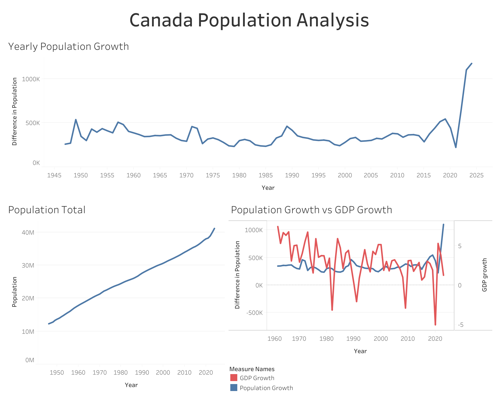

# Understanding Canada's Housing Crisis: Drivers of Supply, Demand, and Price

*A Decision Intelligence Analysis of SDG 11 - Sustainable Cities and Communities*

By: Logan Pugsley

## Visualizations

